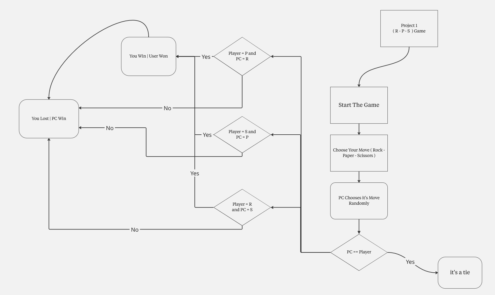
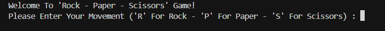
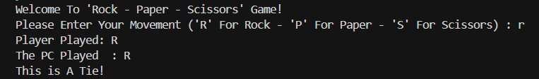
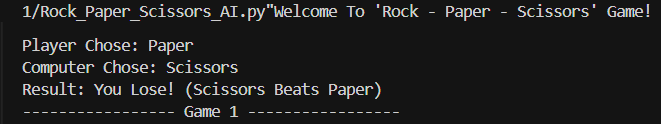

<div align="center">
  

<div align="center">
  
  <h1>Rock-Paper-Scissors Game </h1>
  
  <p>
    <i>The Classic Rock-Paper-Scissors Game, Re-Imagined In Python For An Interactive <strong>Command Line</strong> Experience.</i>
  </p>

  <p>
    <a href="#-about-the-project">About</a> •
    <a href="#-tech-stack--tools">Tech Stack</a> •
    <a href="#-gallery--demo">Gallery</a> •
    <a href="#-features--evolution">Evolution</a> •
    <a href="#-installation--usage">How To Run</a> •
    <a href="#-warnings--troubleshooting">Warnings</a>
  </p>
</div>

<br>

<br>

<h2 align="center" id="-about-the-project">About The Project </h2>

<div align="center">
  <p>
    <i>This Project Marks The <strong>First Milestone</strong> In My Journey Through The <strong>Front-End Diploma (Programming Fundamentals Track)</strong>.</i>
  </p>
  <p>
    <i>It Is Designed Not Just As A Game, But As A Practical Study Of Python Logic. The Repository Features <strong>Two Distinct Versions</strong> Of The Code, Documenting The Transition From Basic Concepts To Structured Programming.</i>
  </p>
  <p>
    <i>The Game Simulates The Classic Real-World Rules, Pitting The Player Against A <strong>Computer Opponent</strong> That Makes Randomized, Unpredictable Moves.</i>
  </p>
</div>

<br>

<br>

<h2 align="center" id="-tech-stack--tools">Tech Stack & Tools </h2>

<div align="center">
  
  
  
</div>

<br>

<div align="center">
  <p>
    • <strong>Python (3.14):</strong> <i>The Core Logic Of The Game Using Loops, Functions, And Dictionaries.</i><br>
    • <strong>Miro:</strong> <i>Used For Designing The Logic Flowcharts And Visualizing The Algorithms Before Coding.</i>
  </p>
</div>

<br>

<br>

<h2 align="center" id="-gallery--demo">Gallery & Demo </h2>

<div align="center">
  <i>The Project Followed A Structured "Plan-Then-Code" Approach. Below Is The Comparison Between The Planning Phase And The Final Output For Both Versions.</i>
</div>
<br>

<table align="center" width="100%">
  <tr>
    <th style="text-align: center;" width="50%">Basic Version</th>
    <th style="text-align: center;" width="50%">Advanced Version</th>
  </tr>
  
  <tr>
    <td align="center">
      <strong>Planning (Logic)</strong><br><br>
      
    </td>
    <td align="center">
      <strong>Planning (Logic)</strong><br><br>
      
    </td>
  </tr>

  <tr>
    <td align="center">
      <strong>Execution (Main Result)</strong><br><br>
      
    </td>
    <td align="center">
      <strong>Execution (Main Result)</strong><br><br>
      
    </td>
  </tr>
</table>

<br>

<div align="center">
<details>
  <summary style="font-size: 1.2em; font-weight: bold; cursor: pointer;">View More Screenshots (Click Here) </summary>
  <br>
  
  <h3>Basic Version - Extra Shots</h3>
  
  
  <br><br><hr><br>
  
  <h3>Advanced Version - Extra Shots</h3>
  
  &nbsp;
  
  
</details>
</div>

<br>

<div align="center">
  <h3>Live Demo </h3>
  <p><i>Watch The Full Gameplay And Code Walkthrough:</i></p>
  
  <a href="https://drive.google.com/file/d/1nP5cY1MpzdGZZ5fUPO9sHh2nQpAdREIp/view?usp=drive_link" target="_blank">
    
    <br>
    <em>Click To Watch Video ▷</em>
  </a>
</div>

<br>

<br>

<h2 align="center" id="-features--evolution">Features & Evolution </h2>

<div align="center">
<i>The Transition From The Basic To The Advanced Version Highlights A Significant Improvement In Code Structure And User Experience.</i>
</div>
<br>

<table align="center" style="border-collapse: collapse; width: 85%;">
  <thead>
    <tr>
      <th align="center" style="border: 1px solid #ddd; padding: 12px; text-align: center;"><strong>Feature</strong></th>
      <th align="center" style="border: 1px solid #ddd; padding: 12px; text-align: center;"><strong>Basic Version</strong></th>
      <th align="center" style="border: 1px solid #ddd; padding: 12px; text-align: center;"><strong>Advanced Version (AI-Ready)</strong></th>
    </tr>
  </thead>
  <tbody>
    <tr>
      <td align="center" style="border: 1px solid #ddd; padding: 10px;"><strong>Architecture</strong></td>
      <td align="center" style="border: 1px solid #ddd; padding: 10px;">Linear Script (Scripting Style)</td>
      <td align="center" style="border: 1px solid #ddd; padding: 10px;"><strong>Modular Functions</strong> (Clean Code)</td>
    </tr>
    <tr>
      <td align="center" style="border: 1px solid #ddd; padding: 10px;"><strong>Game Loop</strong></td>
      <td align="center" style="border: 1px solid #ddd; padding: 10px;">Runs Once And Exits</td>
      <td align="center" style="border: 1px solid #ddd; padding: 10px;"><strong>Continuous Loop</strong> (`While True`)</td>
    </tr>
    <tr>
      <td align="center" style="border: 1px solid #ddd; padding: 10px;"><strong>Logic Handling</strong></td>
      <td align="center" style="border: 1px solid #ddd; padding: 10px;">Long `if-elif` Chains</td>
      <td align="center" style="border: 1px solid #ddd; padding: 10px;">Efficient <strong>Dictionaries</strong> For Rules</td>
    </tr>
    <tr>
      <td align="center" style="border: 1px solid #ddd; padding: 10px;"><strong>User Input</strong></td>
      <td align="center" style="border: 1px solid #ddd; padding: 10px;">Basic Input (`input()`)</td>
      <td align="center" style="border: 1px solid #ddd; padding: 10px;"><strong>Input Validation</strong> & Error Handling</td>
    </tr>
    <tr>
      <td align="center" style="border: 1px solid #ddd; padding: 10px;"><strong>Scalability</strong></td>
      <td align="center" style="border: 1px solid #ddd; padding: 10px;">Hard To Add New Rules</td>
      <td align="center" style="border: 1px solid #ddd; padding: 10px;">Easy To Expand (Update Dictionary)</td>
    </tr>
  </tbody>
</table>

<br>

<div align="center">
  <h3>Key Features in Advanced Version </h3>
  <p>
    • <i><strong>Modular Design:</strong> Broken Down Into Functions (`get_player_choice`, `show_results`), Making It Readable And Reusable.</i><br>
    • <i><strong>Smart Logic:</strong> Uses A `winning_rules` Dictionary To Determine The Winner Instantly Instead Of Multiple Conditions.</i><br>
    • <i><strong>Robust Error Handling:</strong> Prevents Crashes On Invalid Input And Prompts The User Politely.</i>
  </p>
</div>

<br>

<br>

<h2 align="center" id="-installation--usage">Installation & Usage </h2>

<div align="center">
  <i>Follow The Steps Below To Run The Project Locally On Your Machine - Ensure You Have <strong>Python 3.x</strong> Installed.</i>
</div>

<br>

<div align="center">
  <h3>1️⃣ Clone The Repository</h3>
  <i>Open Your Terminal And Run The Following Command To Download The Project Files:</i>
</div>

```bash
git clone https://github.com/hexbido/Rock-Paper-Scissors-Game.git
```

<br>

<div align="center">
  <h3>2️⃣ Run The Basic Version</h3>
  <i>Navigate To The Basic Version Folder And Execute The Script:</i> 
</div>

```bash
cd Basic-Version
python Rock_Paper_Scissors.py
```

<br>

<div align="center">
  <h3>3️⃣ Run The Advanced Version</h3>
  <i>To Try The Enhanced Version With Functions And Loops, Navigate To The Advanced Folder:</i> 
</div>

```bash
cd Advanced-AI-Version
python Rock_Paper_Scissors_AI.py
```

<br>

<br>

<h2 align="center" id="-warnings--troubleshooting">Warnings & Troubleshooting </h2>

<div align="center">
  <p><i>Please Review The Following Notes To Ensure The Application Runs Smoothly:</i></p>
  
  <p>
    • <strong>Input Handling (Basic):</strong> <i>Enter Letters Only (R, P, S). Non-Alphabetic Characters Might Cause Issues.</i><br><br>
    • <strong>Input Handling (Advanced):</strong> <i>Includes Built-in Validation. It Will Not Crash On Invalid Inputs But Will Prompt You To Try Again.</i><br><br>
    • <strong>Display Issues:</strong> <i>If Emojis Do Not Appear In Your Terminal, Ensure Your Console Font Supports UTF-8 Characters.</i>
  </p>
</div>

<br>

<div align="center">
  <p><i>Made With  By <a href="https://github.com/hexbido">B I D O</a></i></p>
</div>

</h3>
